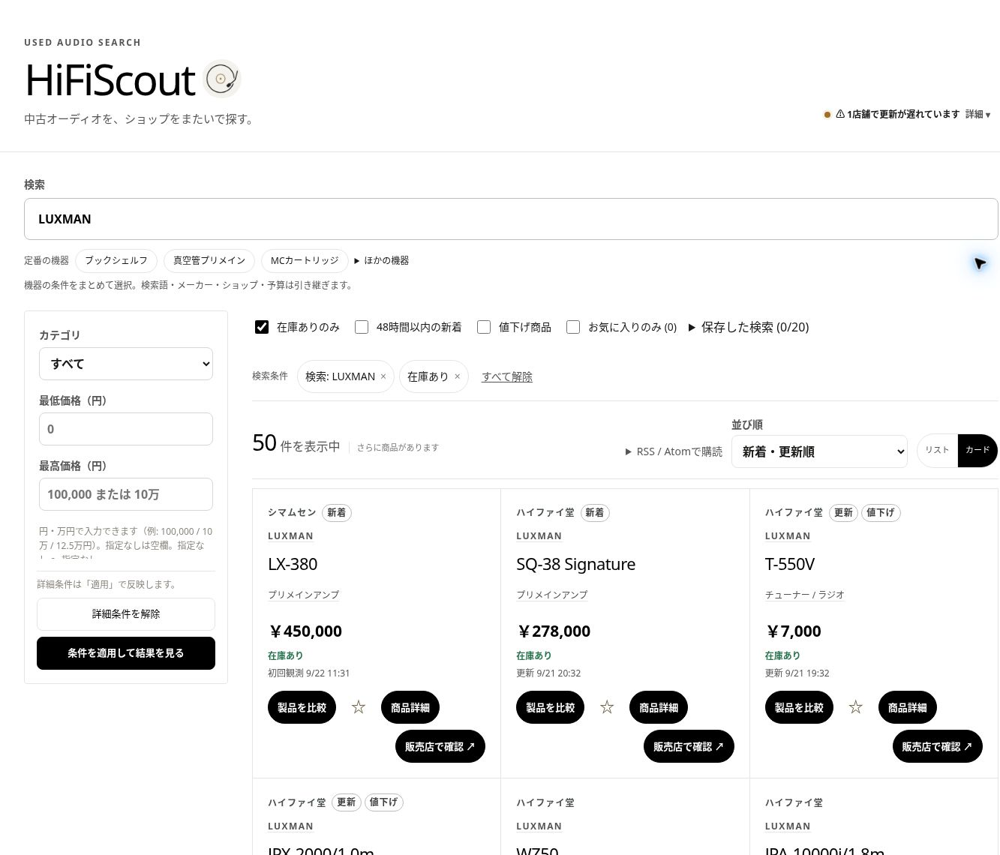
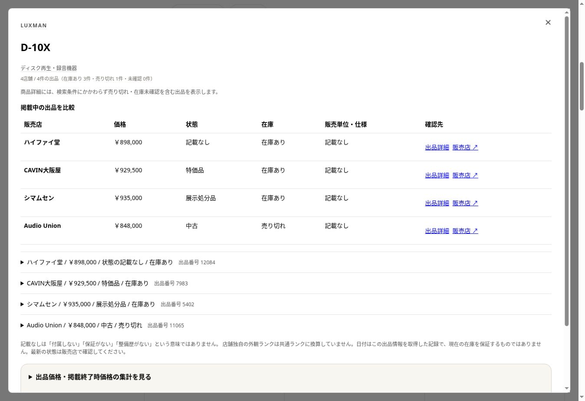

# HiFiScout

[](https://hifiscout.tokyojp.workers.dev/)

**欲しかった一台に、出会うために。**

HiFiScoutは、中古オーディオの情報を複数の販売店からまとめて探せる非公式の検索アプリです。
アンプ、スピーカー、DAC、ヘッドホン、アナログ機器まで。気になる製品の出品を見比べて、販売店の商品ページへ進めます。

**[中古オーディオを探す →](https://hifiscout.tokyojp.workers.dev/)** ·
[画面を見る](#screenshots) · [使い方](#quick-start) · [開発者向け](#developers)

## 探す時間を減らして、聴きたい一台へ

| 🔎 ショップをまたいで探す | ⇄ 同じ製品の出品を比べる | ☆ 気になる一台を追いかける |
| --- | --- | --- |
| メーカー・型番で検索し、カテゴリや予算、在庫などで絞り込み。店舗ごとの検索をまとめられます。 | 同じ製品の出品をまとめ、販売店ごとの価格・在庫・記録された状態を確認できます。 | お気に入り、保存した検索、新着・値下げの絞り込みで、次に探すときも続きから。 |

<a id="screenshots"></a>

## 画面で見るHiFiScout

### 01 — 条件を絞って、候補を見つける

キーワード検索と絞り込みをひとつの画面に。リスト表示とカード表示を切り替えながら探せます。

[](https://hifiscout.tokyojp.workers.dev/)

### 02 — 店舗ごとの出品を確認する

複数の出品がある製品は、詳細画面で見比べられます。
価格だけでなく、記録されている状態・付属品・保証なども確認してから、販売店の商品ページへ。



<sub>画面は2026年9月22日の公開サイトを撮影したものです。表示価格・在庫・件数は撮影時点の情報で、現在の販売状況を保証するものではありません。画面の構成は更新される場合があります。</sub>

<a id="quick-start"></a>

## 使い方

1. **探す** — メーカー名や型番を入力。まだ機種を決めていないときは、機器・カテゴリや予算から絞り込めます。
2. **比べる** — 複数出品の製品は「出品を比較」から店舗ごとの情報を確認。気になる製品は☆でお気に入りに保存できます。
3. **販売店で確認する** — 出品が1件なら商品名から、複数なら詳細画面の出品リンクから販売店へ。最新の価格・在庫・商品状態、購入手続きは販売店で確認してください。

**[HiFiScoutで、次の一台を探す →](https://hifiscout.tokyojp.workers.dev/)**

### ご利用にあたって

- 各販売店とは関係のない非公式ツールです。情報の更新には時間差があり、すべての商品・店舗を網羅するものではありません。
- お気に入りと保存した検索は、お使いのブラウザーに保存されます。
- 販売店の商品画像・説明文・スタッフコメント・ロゴは転載しません。製品の参考写真を表示する場合は、出典付きのメーカー写真を使用します。
- 広い一般公開・告知に進む前に、各収集先の規約と収集方法を改めて確認する方針です。

不具合や改善のご提案は[Issues](https://github.com/apaapapapapa/HiFiScout/issues)へ。
継続して開発を見たい方は、リポジトリのStarもぜひ。

<a id="developers"></a>

## 開発者向け

HiFiScout collects factual seller listings, resolves product identity, and presents product-oriented
search and offer comparison through a React UI on Cloudflare Workers + D1.

[Developer guide](docs/index.md) · [Local development](#local-development) ·
[Architecture](#architecture) · [API and administration](#public-api-and-administration) ·
[Contributor guidance](AGENTS.md)

## Design principles

- Store factual listing data needed for search and link users to the original seller page.
- Do not republish seller images, descriptions, staff comments, or logos.
- User traffic never triggers seller crawling. Per-shop Durable Objects execute scheduled crawls
  with Alarm-based pacing and resumable steps.
- Respect `robots.txt`, authentication boundaries, rate limits, and shop-specific request delays.
- D1 owns retail/catalog facts and search projections; R2 holds bounded evidence and generated exports.
  The disabled Yahoo auction pilot keeps its independent listing facts/search in SQLite DO storage.
- Preserve shop-specific offers and listing price history while grouping safe product identities.

## Architecture

| Component | Responsibility | Source |
| --- | --- | --- |
| Public Worker | Static React UI, public HTTP API, Cron and non-crawl Queue entry points | `src/worker.ts`, `src/index.ts` |
| Crawl control | Reserve a dispatch generation and deliver it to one DO per shop; recover the same token | `src/scheduled.ts`, `src/crawler/dispatch.ts` |
| CrawlScheduler DO | Bounded fetch/parse/finalize steps and PREPARE / Alarm / FETCH pacing | `src/crawler/crawl-scheduler-do.ts` |
| YahooAuctions SQLite DO | Gated auction facts, listing search, bounded collection and shared catalog candidates; disabled by default | `src/auctions/`, [pilot/runbook](docs/yahoo-auctions.md) |
| Shop plugins and relay | Seller discovery/parsing and transport; optional Tokyo Lambda HTTP relay | `src/crawler/shops/index.ts`, `infra/audiounion-lambda/` |
| D1 / FTS5 | Listings, catalog identity, product entities/offers, price projections, durable work | `src/db/`, `migrations/` |
| Post-commit Queues | Knowledge Catalog verification and asynchronous CSV exports; independent of crawling | `src/queue.ts`, `wrangler.jsonc` |
| Admin Worker | Cloudflare Access authentication and internal `CatalogAdminService` RPC | `src/admin/entry.ts`, `wrangler.admin.jsonc` |
| GitHub Actions | CI, deployment, documentation publication, operational telemetry, and backups | `.github/workflows/README.md` |

See [Crawl orchestration](docs/crawl-orchestration.md) and
[Data platform architecture](docs/data-platform-architecture.md) for lifecycle and storage contracts.

## Sources of truth

| Concern | Source of truth |
| --- | --- |
| Registered shops, capabilities, transport, defaults | `src/crawler/shops/index.ts` |
| Deployed bindings and configuration | `wrangler.jsonc`, `wrangler.admin.jsonc` |
| Cron selection and maintenance cadence | `src/scheduled.ts` and registered shop definitions |
| Database schema | Ordered `migrations/*.sql` |
| Auction gates, SQLite schema and recovery | `src/auctions/yahoo/policy.ts`, `src/auctions/storage.ts`, `docs/yahoo-auctions.md` |
| Public search and price summaries | `src/http/public-routes.ts`, `src/db/product-search-price-index-repository.ts` |
| Product identity and exact fallback grouping | `src/catalog/product-identity.ts`, `src/db/product-search-exact-identity.ts` |
| Taxonomy, classification, remediation | `docs/data-quality.md`, `docs/data-quality-remediation.md`, `src/catalog/` |
| Public visual direction | `DESIGN.md` |
| Admin behavior | `docs/listing-admin.md`, `src/admin/contracts.ts` |
| Commands and toolchain | `package.json`, `package-lock.json`, `vite.config.ts` |
| Developer documentation | `docs/index.md` |
| AI contributor instructions and skill routing | [AGENTS.md](AGENTS.md); `CLAUDE.md` imports it |
| Development evidence and completion harness | [.github/harness/README.md](.github/harness/README.md) |

Prefer these sources over historical PR descriptions, completed migration plans, and production snapshots.

## Local development

Install the Vite+ version declared in `package.json`. Vite+ manages the Node.js and npm versions in
`devEngines`; use the root lockfile for reproducible installs.

```bash
vp install --frozen-lockfile
vp run db:migrate:local
vp run dev
```

`dev` builds both frontend bundles before starting Wrangler. For source/config changes, use focused
checks while iterating and run `vp run verify` on the completed candidate. It applies format/lint
fixes, then the read-only gate defined in `package.json`; `vp run check` runs that gate without fixes.
See [validation guidance](AGENTS.md#validation) for documentation and other change scopes.

| Task | Command |
| --- | --- |
| Unit-test suite | `vp run test` |
| One unit-test file | `vp test run test/<name>.test.ts` |
| Build public/admin UI, Workers, and Lambda | `vp run build` |
| Scaffold a shop | `vp run create-shop --key <shop-key> --name "<name>" --base-url https://example.com --transport direct --interval 60` |
| Build developer documentation | `vp run docs:build` |

See [Adding shops](docs/adding-shops.md), [TypeScript development](docs/typescript.md), and
[Testing strategy](docs/testing-strategy.md). Generated browser/Worker/Lambda JavaScript is build output.

## Public API and administration

Primary public endpoints include:

- `GET /api/product-search` — product-level search/filter/sort with eligible offers and price summaries.
- `GET /api/product-search/:key` — one search entity and its offers.
- `GET /api/suggest` — search suggestions.
- `GET /api/products/:id/history` — listing-scoped observed price history.
- `GET /api/meta` — shop state and precomputed metadata counts, including `countsUpdatedAt`.
- `GET /api/health` — crawler-aware health status.
- `GET /api/auctions` — gated auction listing search, disabled by default; independent of retail prices.
- `GET /api/auction-features` — auction serving availability without a DO read.
- `POST /api/product-correction-reports` — submit a bounded product correction report.

The [HTTP API reference](docs/reference/http-api.md) describes executable contract coverage; it is
not yet a complete inventory of every route. Read `src/index.ts` together with the router when
checking reachability: public `/api/admin/*` requests return 404. The separate Access-protected admin
Worker provides catalog/listing corrections, CSV import/export and background jobs through the Service
Binding. Catalog-change, model/category and offer-fact reprocessing use the common jobs screen with
saved progress and pause/resume; see [administration](docs/listing-admin.md). Broader operator maintenance
uses the scoped Actions/scripts documented in the workflow responsibility map.
The separate `#auctions` admin task controls the bounded Yahoo pilot without overriding its
permission, source-contract or account-budget gates; see the [auction runbook](docs/yahoo-auctions.md).

## Operations and resource use

`last_success_at` records collection freshness; `last_projection_at` records completion of derived
work. A fresh collection can therefore coexist with trailing search projections. Durable work items
and cursors let maintenance resume incomplete projections without fetching the seller again.

General Cron serializes watchdog and maintenance work under one D1-call/wall-time budget, persisting
pending tasks across ticks. Normal identity repair consumes a dirty set; the daily exact-identity
safety net advances through bounded candidate windows with a persistent cursor. It does not promise
a full-catalog pass each day. Public metadata and recent price medians read persisted projections.
See the data-platform and crawl guides for the remaining costs and measurement limits.

`Deploy Cloudflare` owns provisioning, migrations, Worker deployment, and the immediate smoke check.
Use that workflow for production deployment; package scripts provide local builds and the migration
steps consumed by the workflow, without a second combined deployment entry point.
Public E2E and admin deployment consume the exact SHA in the `deployment-identity` artifact.
A successful but quota-deferred/no-op deploy does not publish that artifact or change production.

The `data-platform` and `knowledge-catalog` jobs in `Production Operational Health` are intentionally
paused; they do not run production convergence/quality queries or publish health statuses. Its separate
passive jobs still archive native D1 Insights and runtime telemetry to private R2 and analyze saved SQL
archives without application-table scans. Missing telemetry remains unknown rather than zero.
See the [workflow responsibility map](.github/workflows/README.md) before diagnosing or changing CI/CD.

D1 migrations run before the replacement Worker. Add backward-compatible migrations; never edit an
applied migration. Evaluate actual D1 rows read/written, Workers CPU, DO usage, and Queue operations
before claiming that the application fits the free tier.
